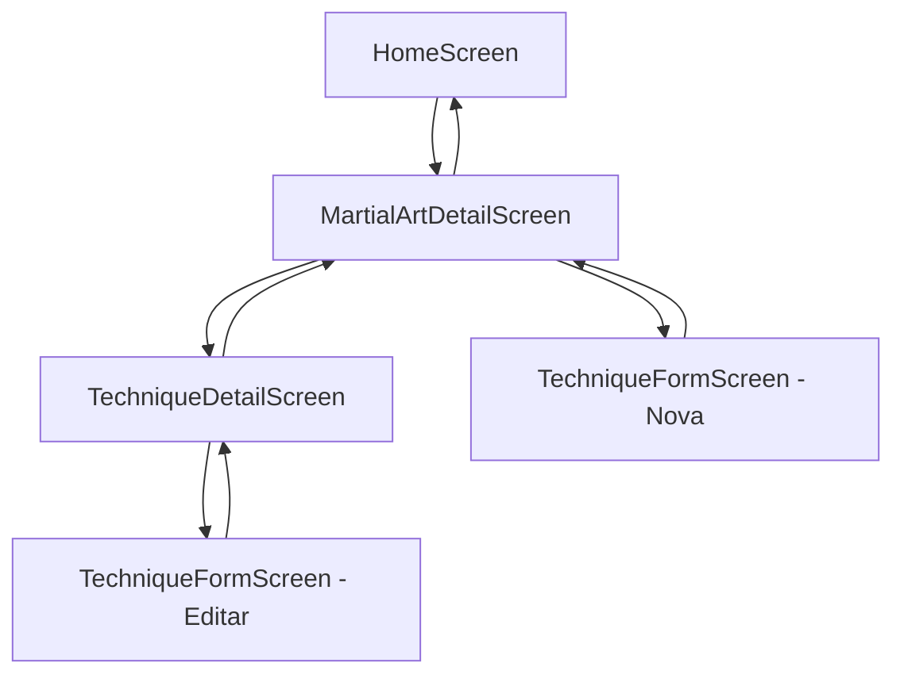
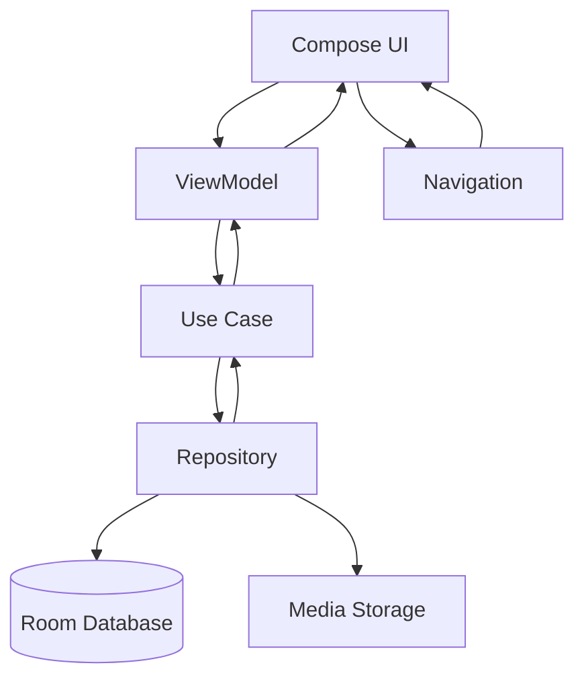

# System Patterns: Lutando
*Version: 1.1*
*Created: 2025-01-27*
*Last Updated: 2025-01-27*

## Architecture Overview
O projeto Lutando segue a arquitetura Clean Architecture com MVVM (Model-View-ViewModel) como padrão de apresentação. A arquitetura é dividida em camadas bem definidas para garantir separação de responsabilidades, testabilidade e manutenibilidade.

## Key Components

### Presentation Layer (UI)
- **Compose UI**: Interfaces de usuário declarativas usando Jetpack Compose
- **ViewModel**: Gerenciamento de estado da UI e comunicação com a camada de domínio
- **Navigation**: Navegação entre telas usando Navigation Compose 2.7.7
- **Theme**: Sistema de design Material 3

### Domain Layer (Business Logic)
- **Entity**: Entidades de negócio (User, Technique, MartialArt)
- **Repository Interface**: Contratos para acesso a dados
- **Use Case**: Casos de uso que implementam a lógica de negócio
- **Domain Model**: Modelos de domínio independentes de frameworks

### Data Layer (Data Access)
- **Repository Implementation**: Implementações concretas dos repositórios
- **Local Data Source**: Room Database para armazenamento local
- **Media Storage**: Gerenciamento de arquivos de mídia (fotos, vídeos, áudios)
- **Data Models**: Modelos de dados para persistência

### Dependency Injection
- **Koin**: Injeção de dependência para gerenciar dependências entre camadas

## Navigation Architecture

### Navigation Compose Implementation
- **NavRoutes.kt**: Definição centralizada de todas as rotas do aplicativo
- **LutandoNavigation.kt**: Componente principal que define o grafo de navegação
- **Type-safe Navigation**: Argumentos tipados para cada rota
- **Deep Linking Ready**: Estrutura preparada para deep linking futuro

### Navigation Flow

### Navigation Routes
- `HOME` - Tela inicial com lista de modalidades
- `MARTIAL_ART_DETAIL/{martialArtId}` - Detalhes da modalidade
- `TECHNIQUE_DETAIL/{techniqueId}` - Detalhes da técnica
- `TECHNIQUE_FORM/{martialArtId}` - Formulário de nova técnica
- `TECHNIQUE_EDIT/{techniqueId}` - Edição de técnica existente

### Navigation Patterns
- **Single Activity**: Uma única Activity com Navigation Compose
- **Argument Passing**: Parâmetros passados via argumentos de rota
- **Back Stack Management**: Navegação automática de volta
- **State Preservation**: Estado preservado durante navegação

## Design Patterns in Use

### MVVM (Model-View-ViewModel)
- **View**: Compose UI components
- **ViewModel**: Gerenciamento de estado e lógica de apresentação
- **Model**: Entidades de domínio e repositórios

### Repository Pattern
- Abstração do acesso a dados
- Permite troca fácil entre fontes de dados
- Facilita testes com mocks

### Use Case Pattern
- Encapsula lógica de negócio específica
- Cada operação CRUD tem seu próprio Use Case
- Facilita testes unitários

### Observer Pattern
- Flow para comunicação reativa entre camadas
- StateFlow para observação de mudanças na UI

### Factory Pattern
- Criação de entidades e modelos
- Injeção de dependências

### Navigation Pattern
- **Single Source of Truth**: Rotas definidas centralmente
- **Type Safety**: Argumentos tipados para navegação
- **Separation of Concerns**: Navegação separada da lógica de negócio

## Data Flow

### Fluxo de Dados Típico:
1. **UI** faz uma requisição através do **ViewModel**
2. **ViewModel** chama o **Use Case** apropriado
3. **Use Case** executa a lógica de negócio e chama o **Repository**
4. **Repository** acessa **Database** ou **Storage** conforme necessário
5. Dados retornam pela mesma cadeia até a **UI**

### Fluxo de Navegação:
1. **User Action** (clique, FAB, etc.) na **UI**
2. **Navigation Callback** é executado
3. **NavController** navega para a rota especificada
4. **Screen** é carregada com argumentos
5. **ViewModel** carrega dados baseado nos argumentos

## Key Technical Decisions

### Clean Architecture
- **Rationale**: Separação clara de responsabilidades, facilitando testes e manutenção
- **Benefit**: Independência de frameworks, facilita mudanças futuras

### MVVM + Compose
- **Rationale**: Padrão moderno para Android, integração nativa com Compose
- **Benefit**: Gerenciamento de estado eficiente, UI reativa

### Navigation Compose
- **Rationale**: Solução oficial do Google para navegação em Compose
- **Benefit**: Type-safe navigation, integração nativa com Compose

### Room Database
- **Rationale**: ORM robusto para SQLite, suporte a Kotlin Coroutines
- **Benefit**: Type-safe queries, migração automática de schema

### Koin para DI
- **Rationale**: Solução leve e eficiente para injeção de dependência
- **Benefit**: Setup simples, integração com Compose

### Local Storage Only
- **Rationale**: POC inicial foca em funcionalidade offline
- **Benefit**: Simplicidade, performance, independência de rede

## Component Relationships

### Entities
- **User**: Representa o usuário do sistema
- **MartialArt**: Representa uma modalidade de arte marcial
- **Technique**: Representa uma técnica específica com seus detalhes

### Use Cases
- **GetAllMartialArtsUseCase**: Obter todas as modalidades
- **GetTechniquesByMartialArtUseCase**: Listar técnicas por modalidade
- **GetCurrentUserUseCase**: Obter perfil do usuário atual

### Repositories
- **UserRepository**: Gerenciamento de dados do usuário
- **MartialArtRepository**: Gerenciamento de modalidades
- **TechniqueRepository**: Gerenciamento de técnicas

### ViewModels
- **HomeViewModel**: Gerenciamento da tela principal
- **MartialArtDetailViewModel**: Lista de técnicas da modalidade
- **TechniqueDetailViewModel**: Detalhes de uma técnica
- **TechniqueFormViewModel**: Adição/edição de técnica

### Navigation Components
- **NavRoutes**: Definição de rotas
- **LutandoNavigation**: Grafo de navegação
- **NavController**: Controle de navegação

## Error Handling Strategy
- **Result Pattern**: Encapsula sucesso/erro em tipos seguros
- **Exception Handling**: Tratamento específico por tipo de erro
- **User Feedback**: Mensagens de erro amigáveis na UI
- **Logging**: Logs estruturados para debugging
- **Navigation Error Handling**: Fallback para rotas inválidas

## Testing Strategy
- **Unit Tests**: Use Cases, ViewModels, Repositories
- **Integration Tests**: Database operations, Media storage
- **UI Tests**: Compose UI components, Navigation
- **Navigation Tests**: Testes de navegação entre telas
- **Mock Strategy**: Repository interfaces para isolamento

## Performance Considerations
- **Lazy Loading**: LazyColumn para listas grandes
- **State Management**: StateFlow para atualizações eficientes
- **Navigation**: Single Activity para performance
- **Database**: Queries otimizadas com Room
- **Memory Management**: ViewModels com lifecycle awareness

---

*This document captures the system architecture and design patterns used in the project.* 