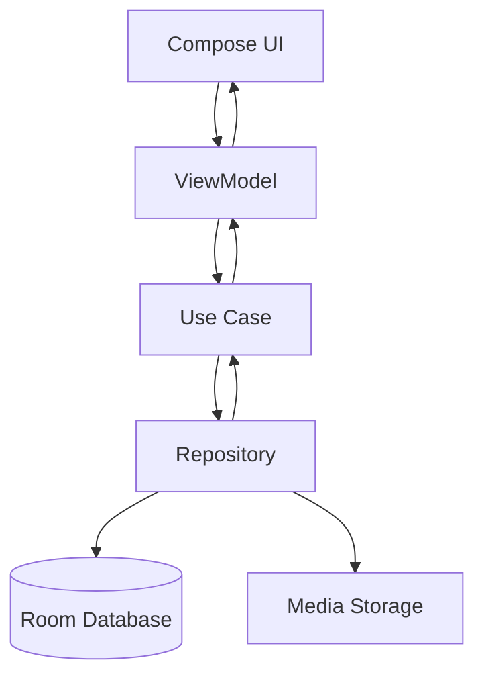

# System Patterns: Lutando
*Version: 1.0*
*Created: 2025-01-27*
*Last Updated: 2025-01-27*

## Architecture Overview
O projeto Lutando segue a arquitetura Clean Architecture com MVVM (Model-View-ViewModel) como padrão de apresentação. A arquitetura é dividida em camadas bem definidas para garantir separação de responsabilidades, testabilidade e manutenibilidade.

## Key Components

### Presentation Layer (UI)
- **Compose UI**: Interfaces de usuário declarativas usando Jetpack Compose
- **ViewModel**: Gerenciamento de estado da UI e comunicação com a camada de domínio
- **Navigation**: Navegação entre telas usando Compose Navigation
- **Theme**: Sistema de design Material 3

### Domain Layer (Business Logic)
- **Entity**: Entidades de negócio (User, Technique, MartialArt)
- **Repository Interface**: Contratos para acesso a dados
- **Use Case**: Casos de uso que implementam a lógica de negócio
- **Domain Model**: Modelos de domínio independentes de frameworks

### Data Layer (Data Access)
- **Repository Implementation**: Implementações concretas dos repositórios
- **Local Data Source**: Room Database para armazenamento local
- **Media Storage**: Gerenciamento de arquivos de mídia (fotos, vídeos, áudios)
- **Data Models**: Modelos de dados para persistência

### Dependency Injection
- **Hilt**: Injeção de dependência para gerenciar dependências entre camadas

## Design Patterns in Use

### MVVM (Model-View-ViewModel)
- **View**: Compose UI components
- **ViewModel**: Gerenciamento de estado e lógica de apresentação
- **Model**: Entidades de domínio e repositórios

### Repository Pattern
- Abstração do acesso a dados
- Permite troca fácil entre fontes de dados
- Facilita testes com mocks

### Use Case Pattern
- Encapsula lógica de negócio específica
- Cada operação CRUD tem seu próprio Use Case
- Facilita testes unitários

### Observer Pattern
- Flow para comunicação reativa entre camadas
- LiveData para observação de mudanças na UI

### Factory Pattern
- Criação de entidades e modelos
- Injeção de dependências

## Data Flow

### Fluxo de Dados Típico:
1. **UI** faz uma requisição através do **ViewModel**
2. **ViewModel** chama o **Use Case** apropriado
3. **Use Case** executa a lógica de negócio e chama o **Repository**
4. **Repository** acessa **Database** ou **Storage** conforme necessário
5. Dados retornam pela mesma cadeia até a **UI**

## Key Technical Decisions

### Clean Architecture
- **Rationale**: Separação clara de responsabilidades, facilitando testes e manutenção
- **Benefit**: Independência de frameworks, facilita mudanças futuras

### MVVM + Compose
- **Rationale**: Padrão moderno para Android, integração nativa com Compose
- **Benefit**: Gerenciamento de estado eficiente, UI reativa

### Room Database
- **Rationale**: ORM robusto para SQLite, suporte a Kotlin Coroutines
- **Benefit**: Type-safe queries, migração automática de schema

### Hilt para DI
- **Rationale**: Solução oficial do Google para injeção de dependência
- **Benefit**: Compile-time validation, integração com Android lifecycle

### Local Storage Only
- **Rationale**: POC inicial foca em funcionalidade offline
- **Benefit**: Simplicidade, performance, independência de rede

## Component Relationships

### Entities
- **User**: Representa o usuário do sistema
- **MartialArt**: Representa uma modalidade de arte marcial
- **Technique**: Representa uma técnica específica com seus detalhes

### Use Cases
- **GetUserProfile**: Obter perfil do usuário
- **GetTechniques**: Listar técnicas por modalidade
- **AddTechnique**: Adicionar nova técnica
- **UpdateTechnique**: Atualizar técnica existente
- **DeleteTechnique**: Remover técnica
- **GetTechniqueDetails**: Obter detalhes de uma técnica

### Repositories
- **UserRepository**: Gerenciamento de dados do usuário
- **TechniqueRepository**: Gerenciamento de técnicas
- **MediaRepository**: Gerenciamento de arquivos de mídia

### ViewModels
- **MainViewModel**: Gerenciamento da tela principal
- **TechniqueListViewModel**: Lista de técnicas
- **TechniqueDetailViewModel**: Detalhes de uma técnica
- **AddTechniqueViewModel**: Adição de nova técnica

## Error Handling Strategy
- **Result Pattern**: Encapsula sucesso/erro em tipos seguros
- **Exception Handling**: Tratamento específico por tipo de erro
- **User Feedback**: Mensagens de erro amigáveis na UI
- **Logging**: Logs estruturados para debugging

## Testing Strategy
- **Unit Tests**: Use Cases, ViewModels, Repositories
- **Integration Tests**: Database operations, Media storage
- **UI Tests**: Compose UI components, Navigation
- **Mock Strategy**: Repository interfaces para isolamento

---

*This document captures the system architecture and design patterns used in the project.* 